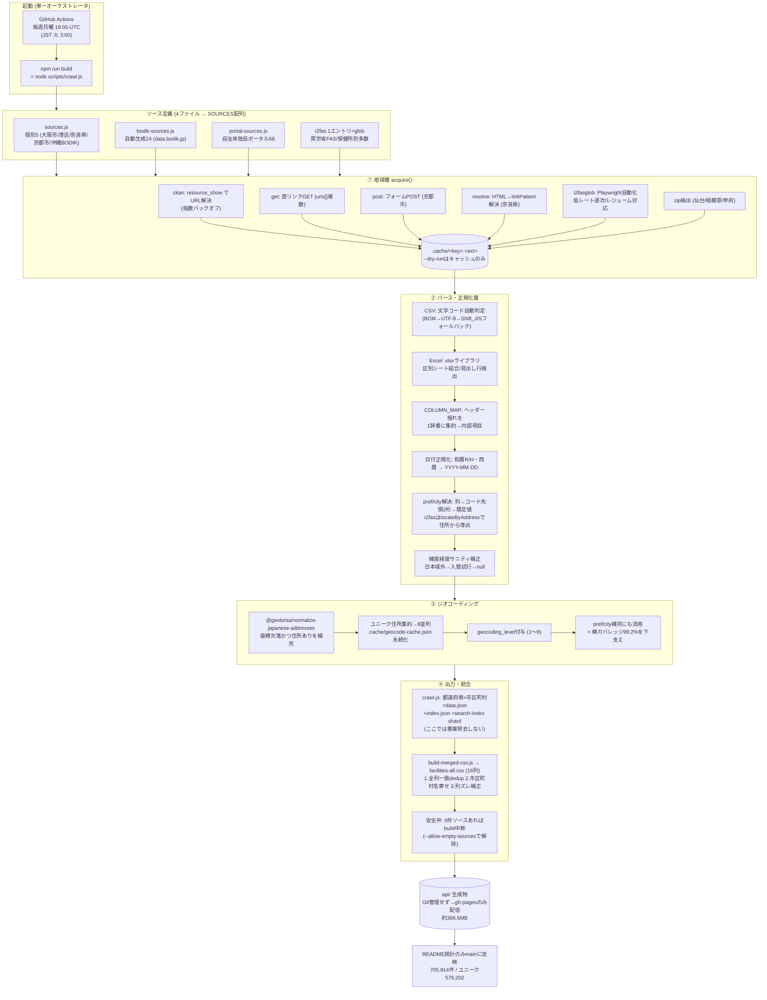

# 調査メモ：大橋さん本家 `japan-facilities-address` の取得構造と網羅性

> 対象リポジトリ: https://github.com/gl20percentclub/japan-facilities-address
> 調査日: 2026-07-17 ／ 調査時点の README 統計: 2026-07-09
> 位置づけ: 当プロジェクトの「食品オープンデータ再現パイプライン」(`scripts/reproduce_food_opendata/`) が
> リバースエンジニアリングで再現しようとしている `facilities-all.csv` の**生成元そのもの**。

---

## 0. 要約（結論だけ先に）

- **横の網羅（どの自治体をカバーしているか）＝ ほぼ天井。** データあり 1,727 / 1,741 市区町村 = **99.2%**。
  制度構造（発行権限は保健所設置主体157に帰属）に完全準拠した3段フォールバック設計で、
  オープンデータで届く上限にほぼ達している。残る14件は都道府県所管の小村・島しょで、コードでは埋まらない。
- **縦の網羅（各自治体内で全施設を取れているか）＝ 構造的に不完全。** カバー済みの**60%（1,037件）が i2fas 依存**で、
  i2fas は「掲載賛同施設のみ」＝全件ではない。ただしこれは本家コードの限界ではなく**データ供給側（公開元）の限界**。
- **ジオコーディングは施設件数を増やさない。** 増やすのは「座標の網羅」と「行政区画帰属の網羅」。
  後者（住所→市区町村の確定）が横カバレッジ99.2%を下支えしている。

---

## 1. 全体パイプライン

`npm run build`（＝ `node scripts/crawl.js`）が単一オーケストレータとして
**取得 → パース → 正規化 → ツリー化 → ジオコーディング → 出力**を一気通貫で実行する。



- 生成物 `api/` は **Git 管理せず**（`.gitignore`）。配信は **gh-pages ブランチのみ**（履歴肥大回避）。
- **GitHub Actions が毎週月曜 18:00 UTC（JST 火曜 3:00）に自動実行**（`.github/workflows/crawl.yml`）。
  `workflow_dispatch` で手動実行も可（`dry_run` / `fetch_i2fas` オプション付き）。
- 全ソース＋i2fas で100万件超になるため Node ヒープを `--max-old-space-size=12288` に拡張。
- main に反映するのは README の統計だけ。

### 現況統計（README 2026-07-09 時点）
| 項目 | 値 |
|---|---|
| 施設レコード数 | 705,914 件 |
| ユニーク施設数（名前+座標） | 576,202 件 |
| 都道府県 | 47 |
| 市区町村 | 1,872 |
| `api/` 合計サイズ | 約 366.6 MB |

---

## 2. 取得層（`acquire()`）

ソース定義は4ファイルに分割し `SOURCES` 配列に合流する。

| ファイル | 中身 | エントリ数 |
|---|---|---|
| `sources.js`（個別） | 大阪市 / 東京都港区 / 奈良県 / 京都市 / 沖縄BODIK | 5 |
| `bodik-sources.js`（自動生成） | data.bodik.jp 掲載自治体（`gen-bodik-sources.mjs` で再生成） | 24 |
| `portal-sources.js` | 各自治体の独自ポータル／自庁サイト直リンク | 68 |
| i2fas（1エントリ＝glob） | 厚労省 食品衛生申請等システム。`fetch-i2fas.mjs` 取得の `.cache/i2fas/*.csv` を一括読込 | 1（実体は保健所別多数） |

→ 直接取得ソース約97 ＋ i2fas。当プロジェクトが想定していた「92出典」から**増加している（本家は継続更新中）**。

> **用語: i2fas とは**
> 厚生労働省「**食品衛生申請等システム**」（Food Sanitation Application System）の通称。飲食店などが
> 食品営業許可・届出を**電子申請**するための全国システムで、その申請データの一部がオープンデータとして公開されている。
> - **取得方式が別格**: 他ソースが CKAN/直リンク等で取れるのに対し、i2fas だけは `i2fasglob`
>   （Playwright によるブラウザ自動化・多段 JSP フロー・robots.txt 尊重の低レート逐次・レジューム対応）で取得する。
>   実体は保健所設置主体ごとの多数 CSV（`.cache/i2fas/*.csv`）を1エントリの glob として束ねている。
> - **網羅性での位置づけ（最重要）**: カバー済み1,727市区町村の **60%（1,037件）がこの i2fas 依存**＝最大のフォールバック層。
>   ただし i2fas は**「電子申請し、かつ掲載に賛同した施設のみ」のオプトイン公開**で全件ではない。
>   これが「横カバレッジ99.2%を支える一方、縦（各自治体内の悉皆性）は構造的に不完全」という結論の元凶。
>   収集優先度では最下層（①自治体自身 → ②管轄保健所設置主体 → ③**i2fas** → ④無し）。

### 取得方式（`acquire.type`）
- `ckan` — `resource_show` API で実URLを解決（403/429/5xx は指数バックオフでリトライ）
- `get` — 直リンク GET（`urls[]` で複数ファイル対応）
- `post` — フォーム POST（京都市）
- `resolve` — 掲載ページ HTML から `linkPattern` に一致するリンクを解決（ファイル名に日時が入る奈良県対策）
- `i2fasglob` — Playwright ブラウザ自動化で別途取得（多段 JSP フロー、robots.txt 尊重で低レート逐次、レジューム対応）
- 加えて `format:'zip'` で ZIP 内 CSV/XLSX を抽出（仙台 / 相模原 / 甲府）

取得物は全て `.cache/<key>.<ext>` にキャッシュ。`--dry-run` はキャッシュのみ使用（CKAN 問い合わせもしない）。

---

## 3. パース・正規化層

- **CSV**: 文字コード自動判定（BOM ＋ UTF-8 妥当性 → 化ける場合 Shift_JIS フォールバック）。utf-16 / tsv も対応。
- **Excel**: `xlsx` ライブラリ。`allSheets` で区別シート結合（京都市・仙台）、見出し行の自動検出。
- **列マッピング `COLUMN_MAP`**: 旧式／GIF標準／i2fas／各自治体のヘッダー揺れ（全角＿・半角_・英語ヘッダー含む）を
  **1枚の辞書に集約**して内部項目へ。
- **日付正規化**: 和暦 R/H・西暦・各種区切りを `YYYY-MM-DD` へ。
- **都道府県/市区町村の解決**: 列 → 市区町村コード先頭2桁 → ソース既定値 の順。
  i2fas は `locateByAddress` で**管轄カラム（保健所所在地）を信用せず施設住所から導出**。
- **緯度経度サニティ補正**: 日本域 `[20-46, 122-154]` 外なら緯度経度の入替を試行、それでも域外なら null（大阪市の緯度経度逆転対策）。

---

## 4. ジオコーディング

座標欠落かつ住所ありの施設を `@geolonia/normalize-japanese-addresses` で補完。

- ユニーク住所に集約 → 8並列 → `.cache/geocode-cache.json` に永続化（週次クロールを高速化）。
- `geocoding_level`（1=都道府県代表点 / 2=市区町村 / 3=町丁目重心 / 8=街区・地番）を付与。
- **座標だけでなく pref/city の補完にも流用**（市区町村カラムが無いデータの帰属確定）。
- 一過性エラー（ネット障害・レート制限）はキャッシュせず次回再試行。恒久失敗のみ null 記録。

---

## 5. 出力・統合CSV

- `crawl.js`: `都道府県 > 市区町村 > data.json` の3階層 ＋ `index.json` ＋ `search-index`（都道府県別 shard）。
  **ここでは重複除去しない**（業種違いは別許可レコードとして全量保持）。
- `build-merged-csv.js`: 全 `data.json` を1本の `facilities-all.csv`（16列）へ。ここで浄化:
  1. **全列一致の重複除去**
  2. **市区町村名の名寄せ**（`_city_normmap.json` ＋ 郡名剥がし。正規化名を `city`、生表記を `city_raw` に保存）
  3. **列ズレ補正**（富山県: pref=郵便番号 / city=都道府県名 のズレを住所先頭から復元）
- **安全弁**: 1件も取れなかったソースがあると build を中断（取得失敗が黙って欠落データ化するのを防ぐ。`--allow-empty-sources` で解除）。

### 16列スキーマ（当プロジェクトの再現パイプラインと同一）
```
prefecture, city, city_raw, name, name_kana, business_type, address, lat, lng,
geocoding_level, phone, license_no, license_date, expire_date, sources, licenses
```

---

## 6. 網羅性の評価（実測ベース）

`docs/COVERAGE.md`（1,741市区町村が母数）を集計した実測値。

| 収集経路 | 件数 | 割合 |
|---|---:|---:|
| i2fas | 1,037 | 60.0% |
| 管轄主体 | 618 | 35.8% |
| 自身 | 72 | 4.2% |
| **データあり計** | **1,727** | **99.2%** |
| 未収集（❌） | 14 | 0.8% |

> **用語: 収集経路の3分類（自身 / 管轄主体 / i2fas）**
> 同じ市区町村が複数経路でカバーされ得るため、**より一次に近い順**に「①自身 → ②管轄主体 → ③i2fas」で判定する。
> - **自身**: その市区町村**自身**が自区域の施設データをオープンデータ公開しているケース（72件・4.2%）。
>   注意点は、食品営業許可の**発行権限は保健所設置主体（157）にしかない**こと。一般市町村は許可を出さず、
>   区域内施設は都道府県保健所が所管する。にもかかわらず**許可権限を持たない一般市町村が「二次公開」として
>   自区域分を独自公開している**のが「自身」の実態（例: 久万高原町・和水町・東村山市）。件数は最少だが、
>   自治体が責任を持って出す分として最も信頼でき最優先に置く。
> - **管轄主体**: その市区町村自身は公開しないが、**その区域内の施設に許可を発行している保健所設置主体**が
>   公開しているケース（618件・35.8%）。**制度上の本来の許可台帳保有者**であり、データの一次性・信頼性は「自身」に次いで高い。
>   - **保健所設置主体は全国157**: 都道府県47・指定都市20・中核市62・その他政令市5・特別区23（厚労省「設置主体別保健所数」令和8年4月1日現在）。
>   - 一般市町村域の施設は多くが**都道府県の公開データ**として現れる（例: 県内の小さな町の施設が町ではなく県のODに載る）。
>     政令市・中核市域なら当該市が管轄主体になる。
>   - **縦の網羅性が i2fas より高い**: 賛同施設のみのオプトイン公開である i2fas と違い、原則**全件が載る許可台帳**だから。
>     ただし「新規許可のみ」「古いスナップショット」など供給側都合の穴は管轄主体データにも混じり得る（7節②参照）。
> - **i2fas**: 上2つが無く、厚労省 i2fas に賛同施設として掲載があるケース（1,037件・60.0%）。最下層のフォールバック。

### 制度前提
- 食品営業許可の**発行権限は「保健所設置主体（157）」**にある＝都道府県47・指定都市20・中核市62・その他政令市5・特別区23。
  （出典: 厚労省「設置主体別保健所数」令和8年4月1日現在）
- 一般市町村は許可を発行しない（区域内施設は都道府県保健所が所管）。ただし二次公開はあり得る（久万高原町・和水町・東村山市 等）。
- 判定優先順位: ①自治体自身が公開 → ②管轄保健所設置主体が公開 → ③i2fas に該当施設あり → ④いずれも無ければ❌。

### 未収集14件（全て都道府県所管の小村・島しょ）
青森県 中津軽郡西目屋村 / 秋田県 雄勝郡東成瀬村 / 群馬県 佐波郡玉村町 / 埼玉県 秩父郡東秩父村 /
東京都 利島村・新島村・神津島村・三宅村・御蔵島村・八丈町・小笠原村 /
新潟県 三島郡出雲崎町 / 福岡県 糟屋郡須恵町 / 佐賀県 杵島郡大町町

→ いずれも「所管の都道府県がODを出しておらず、かつi2fasに賛同施設ゼロ」。コードでは埋まらず情報公開請求の領域。

---

## 7. 「これ以上ない仕組みか？」への回答

網羅性は**2軸に分けて評価すべき**で、答えは逆になる。

### ① 横（自治体カバレッジ）＝ ほぼ天井。「これ以上ない」と言ってよい
`自身 → 管轄主体 → i2fas` の3段フォールバックは制度構造にドンピシャで、99.2%到達。
残る14件は供給側の空白でコード側の余地はほぼ無い。

### ② 縦（施設の悉皆性）＝ 構造的に不完全。ただし本家コードの限界ではない
カバー済み1,727件の**過半（1,037件・60%）が i2fas 依存**。i2fas は**「掲載賛同施設のみ」＝オプトイン公開で全件ではない**。
表の✅は「1件でもあれば✅」なので悉皆性を保証しない。加えて縦の穴:
- **「新規許可のみ」ソース**の混在（浜松市新規 / 愛知県新規許可 / 久留米市新規 等）＝ 全件ストックでなくフロー
- **古いスナップショット**（京都市 R3.3末、鹿児島市 R3.6改正前）
- **届出施設**の網羅は許可施設より薄い

→ これは公開元が全件を出していない**データ供給の限界**。コード側で押し上げる唯一の一手は、
i2fas依存の市区町村について**管轄主体が別途「全件」ODを出していないかの再探索**（現在は手キュレーション。
CKAN横断・自治体サイト自動巡回で発見を機械化する余地）。

---

## 8. 「ジオコーディングでさらに網羅できているか？」への回答

**重要：ジオコーディングは施設件数（母数）を1件も増やさない。** ソースに無い施設は生み出せない。
埋めるのは別の2軸:

1. **座標の網羅** — lat/lng欠落施設に座標付与（`geocoding_level` 付き）。
   ただし精度はレベル制で、level 3=丁目中心など**建物精度でない座標も混じる**。厳密ジオコーダーではない。
2. **行政区画帰属の網羅（本題に効く）** — 市区町村カラムが無い/管轄カラムが当てにならないデータの pref/city を
   **住所から確定**し「不明」を減らす。特に **i2fas は `locateByAddress` で施設住所から市区町村を導出**しており、
   これが無いと1,037件のi2fasデータを正しい市区町村に配置できない。
   **＝ 横カバレッジ99.2%はジオコーディングが下支えしている。**

→ ジオコーディングは「帰属の網羅」で横カバレッジを支えるが、**各自治体内の施設悉皆性（縦）には無力**。

---

## 9. 当プロジェクトの再現パイプラインとの対比・気づき

1. **ソース総数が想定「92」から ~97＋i2fas に増加**（本家は継続更新中）。
2. **件数の食い違い**: 当メモリでは「大橋 facilities-all.csv = 約145万件」だが、現行 README は **705,914件**（全列一致dedup後）。
   スナップショット時点差か、以前の集計が別スコープ（dedup前 or 別版）かは**要確認**。
3. **設計はほぼ一致**: 16列スキーマ・多形式取得・和暦正規化・i2fas重ね・名寄せ ―
   再現パイプラインのリバースエンジニアリングは方向として正しかった。
   **ただし本家は名寄せが緩め（全列一致dedupのみ、施設単位の名寄せはせず業種違いを残す）**。
   当MVPは「名称+住所+業態」キーで重複除去していたため、ここが件数差（一致度97-101%）の一因の可能性。

### 次の検証候補
- (a) i2fas依存1,037件のうち、管轄主体が全件ODを出している自治体の自動発見
- (b) 実データで「i2fas由来市区町村の件数 vs 想定施設数」の乖離測定
- (c) 145万件 vs 705,914件 の食い違いを実データで突き合わせ
